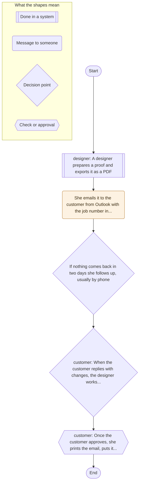
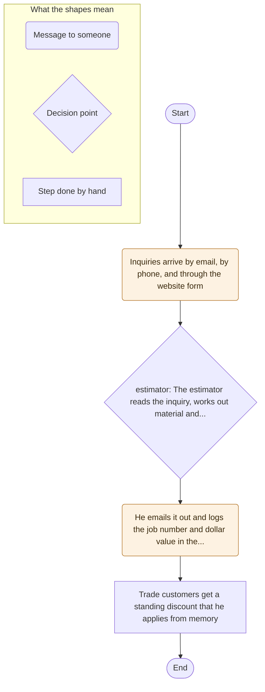
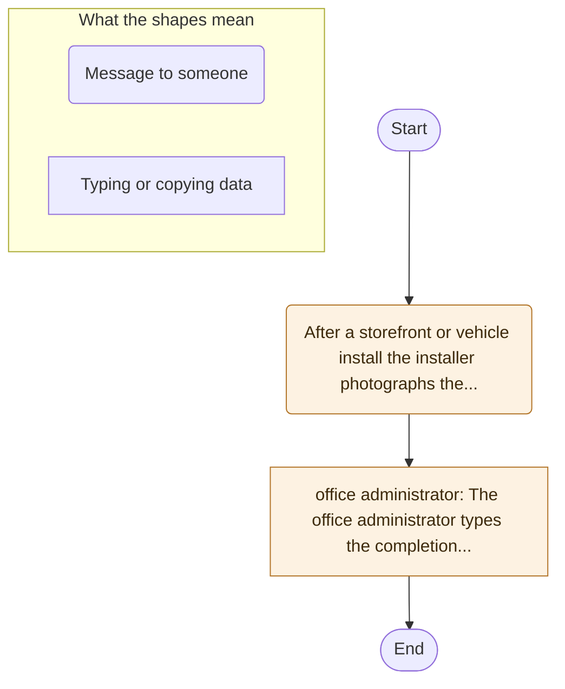
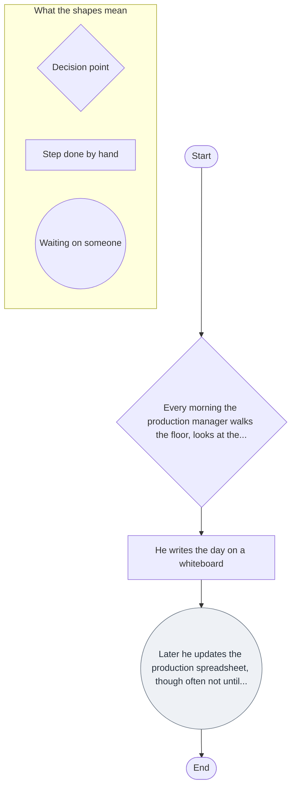
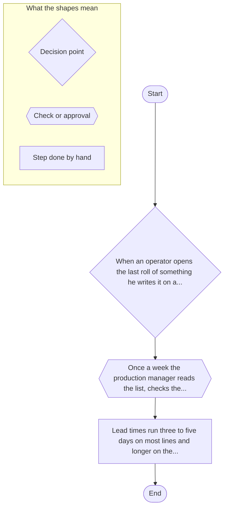

# Automation review: Bayside Print and Signs

Commercial printing, vehicle wraps, and storefront signage | 17 people | 5 processes reviewed
Intake collected 2026-08-08.
Generated 2026-08-08 against rubric 1.4.0-draft by judge `stub-heuristic-v1` in stub mode.

## In short

**Getting artwork approved by the customer** is the strongest candidate of the 5 processes reviewed, scoring 3.92 out of 5.00 and landing in Worth a pilot. What puts it top is software automatability: All 5 steps read as work software could do, with nothing in the description that needs physical handling or a person present.
The thing most likely to stop it is implementation risk, scored 5 out of 5.

> This report was generated by an AI system. It scores each process against a fixed rubric and ranks the results. It has not visited the business, spoken to anyone, or checked any of the figures it was given. Treat every finding as a starting point for a human review, not as a decision.

## Read this before the rankings

- Scores in this report came from the stub judge, which applies fixed thresholds to the intake rather than making a judgement. They show that the pipeline runs. They are not an assessment.
- Rubric 1.4.0-draft is a draft and has not been approved, so the weights behind these rankings are still open to change.
- No number is tracked today for Scheduling the press floor, Reordering print media and vinyl, so the return on those cannot be evidenced and their return band is capped. The first piece of work on any of them is to start counting.
- 1 process left the ranking entirely because software cannot perform the work. They are listed after the rankings.

## Ranked opportunities

| no. | Process | Recommendation | Score | Main limit |
| --- | --- | --- | --- | --- |
| 1 | Getting artwork approved by the customer | Worth a pilot | 3.92 | Implementation risk (5/5) |
| 2 | Quoting trade and retail work | Worth a pilot | 3.76 | Implementation risk (5/5) |
| 3 | Closing out installation paperwork | Worth a pilot | 3.12 | Implementation risk (4/5) |
| 4 | Scheduling the press floor | Worth a pilot | 3.12 | Implementation risk (4/5) |
| 5 | Reordering print media and vinyl | Watch list | 2.88 | Pain (2/5) |

The list is ordered by score. A capped process keeps its place in the order, because a cap limits what can be recommended and does not change what the process scored.

Scores run from 1.00 to 5.00. Bands are set in rubric 1.4.0-draft:
Strong candidate at 4.00 and above;
Worth a pilot at 3.00 and above;
Watch list at 2.00 and above;
Not a fit at 0.00 and above.

## Outside software automation

1 process did not go into the ranking above. Scoring it against processes software can perform would produce a number that answers a question you did not ask, so it is reported here instead.

### Installing storefront signs on site

No part of this process can be automated with software. The work is physical, in person, or otherwise outside what software can touch.

From the description: Two installers load the finished sign, the brackets, and the lift onto the truck.

This process would benefit from collaboration with a robotics automation specialist local to your area.

## Sequencing note: system changes already planned

The business told us it is already planning to change the system behind 3 of these processes. This did not affect any score, band, or ranking above. It is reported here because it is a question of when and how to build, not whether.

| Process | What is changing | Timeframe |
| --- | --- | --- |
| Getting artwork approved by the customer | We have signed for a print management system called Clarity that has a customer approval portal built in, and it is supposed to go live at the end of the quarter. | within 3 months |
| Closing out installation paperwork | The installers have been asking for a phone app to capture sign off on site, and one of the owners has been looking at options but nothing is chosen. | later, or not yet known |
| Scheduling the press floor | The same Clarity system is supposed to include a scheduling board, but the owners have not agreed whether the floor will use it or whether the whiteboard stays. | in 3 to 12 months |

This engine does not yet work out what the sequencing should be. Deciding whether to build now, build after the change, or design around it is a judgement for the human review, and the reasoning belongs in the write up rather than in a number.

## How the scoring works

Each process is scored from 1 to 5 on 7 criteria. All but one point the same way, where a higher score means a better candidate. Implementation risk points the other way, so it is inverted before the weighted score is worked out. The inversion is done by the engine, not by the judge.

| Criterion | Weight | Direction |
| --- | --- | --- |
| Pain | 0.16 | higher is better |
| Frequency | 0.12 | higher is better |
| Volume | 0.12 | higher is better |
| Data availability | 0.16 | higher is better |
| Implementation risk | 0.12 | higher is worse, inverted by the engine |
| Return band | 0.12 | higher is better |
| Software automatability | 0.20 | higher is better |

Two criteria have a ceiling that applies whatever the process itself looks like:

- Return band cannot go above 2 out of 5 where the business tracks no number for the process today. The business tracks no number for this process today, so any saving could be claimed but not shown. The first piece of work here is to start counting.

One further rule sits outside the arithmetic entirely. A weighted average lets five good criteria outvote one bad one, which is right for a score and wrong for a recommendation:

- Any process scoring 5 or more on implementation risk cannot be recommended above Worth a pilot. Getting this wrong is a serious event, so it cannot be recommended above a time boxed pilot however well it scores elsewhere.

Where that cap applies, the score is still reported exactly as calculated and the band the score earned is shown next to it, so the number the cap overrode is visible.

A third rule removes a process from the ranking rather than adjusting it:

- A process scoring 1 on software automatability gets no weighted score and no band at all. No part of this process can be automated with software. The work is physical, in person, or otherwise outside what software can touch.

---

## 1. Getting artwork approved by the customer

**Worth a pilot, weighted score 3.92.**

Owner: Naomi Petrakis.
Runs daily, about 250 times a year, handling 18 proofs a day, which works out at roughly 4,500 proofs a year.
Time spent: 22 hours a week, which is about 1,056 hours a year, across 4 people.
Decision type: mixed.
A mistake here is seen by a customer.
Tracked today: average days from proof sent to approval, tracked in the production spreadsheet, currently about three
Tools in use: Outlook, shared drive, Excel, paper job tickets, phone.
Risk flags reported: handles money.
A system change is already planned here: We have signed for a print management system called Clarity that has a customer approval portal built in, and it is supposed to go live at the end of the quarter. Timeframe: within 3 months. This did not affect the score.

**What the business said hurts:** Approval is where jobs stall. The average job sits three days waiting on a reply and nobody knows which ones are stuck without opening the spreadsheet. Two jobs went to press on a superseded proof last quarter, one of them a full vehicle wrap that had to be redone at a cost of about twenty five hundred dollars. Designers say the follow up is the worst part of the job, and one quit in April and said so on the way out.

### Scores

| Criterion | Score | Weight | Rationale |
| --- | --- | --- | --- |
| Pain | 4/5 | 0.16 | The business describes mistakes and rework, delays and chasing, and the strain on staff across a process that changes hands 1 time. |
| Frequency | 5/5 | 0.12 | Stated frequency of daily works out at about 250 runs a year. |
| Volume | 4/5 | 0.12 | About 4,500 proofs a year, from 18 proofs a day. The business gave this as an estimate. |
| Data availability | 3/5 | 0.16 | The records sit in the shared drive in a mostly consistent shape, though some of the input still arrives in a form that has to be handled by hand first. |
| Implementation risk (inverted) | 5/5 | 0.12 | This process is flagged as handles money, the work is mixed, a couple of cases in ten need handling differently, and an error would be seen by a customer rather than caught inside the business. |
| Return band | 5/5 | 0.12 | About 1,056 hours a year go into this process, from 22 hours a week over 48 working weeks. The business already tracks: average days from proof sent to approval, tracked in the production spreadsheet, currently about three. |
| Software automatability | 5/5 | 0.20 | All 5 steps read as work software could do, with nothing in the description that needs physical handling or a person present. |

Strongest part of the case: software automatability. Most likely to stop it: implementation risk.

### Process map

The engine inferred 5 steps from the description, of which 2 are done by hand. It found 1 handoff between people and 0 waiting steps.
This map was read out of the description by a rule based parser. Check it before relying on it.

---
## 2. Quoting trade and retail work

**Worth a pilot, weighted score 3.76.**

Owner: Ray Underhill.
Runs daily, about 250 times a year, handling 12 quotes a day, which works out at roughly 3,000 quotes a year.
Time spent: 20 hours a week, which is about 960 hours a year, across 2 people.
Decision type: judgment heavy.
A mistake here is seen by a customer.
Tracked today: quotes sent per day and total quoted value, logged in the quotes tab
Tools in use: Outlook, Excel, Microsoft Word, website form, phone.
Risk flags reported: handles money.

**What the business said hurts:** The estimator is the bottleneck for the whole shop and he knows it. Quotes go out same day when he is in and three days late when he is not, and the owners think they lose work on the slow ones but cannot prove it. The costing spreadsheet has grown to fourteen tabs and only he understands the press time formulas. He is the single point of failure everyone jokes about.

### Scores

| Criterion | Score | Weight | Rationale |
| --- | --- | --- | --- |
| Pain | 2/5 | 0.16 | The business describes delays and chasing. |
| Frequency | 5/5 | 0.12 | Stated frequency of daily works out at about 250 runs a year. |
| Volume | 4/5 | 0.12 | About 3,000 quotes a year, from 12 quotes a day. The business gave this as an estimate. |
| Data availability | 4/5 | 0.16 | Excel holds this in structured fields, though some of the input still arrives in a form that has to be handled by hand first. |
| Implementation risk (inverted) | 5/5 | 0.12 | This process is flagged as handles money, the work is judgment heavy, a large minority of cases need handling differently, and an error would be seen by a customer rather than caught inside the business. |
| Return band | 5/5 | 0.12 | About 960 hours a year go into this process, from 20 hours a week over 48 working weeks. Minutes per item across the year would suggest 1,250 hours, so the two figures given do not fully agree. The business already tracks: quotes sent per day and total quoted value, logged in the quotes tab. |
| Software automatability | 5/5 | 0.20 | All 4 steps read as work software could do, with nothing in the description that needs physical handling or a person present. |

Strongest part of the case: software automatability. Most likely to stop it: implementation risk.

### Process map

The engine inferred 4 steps from the description, of which 3 are done by hand. It found 0 handoffs between people and 0 waiting steps.
This map was read out of the description by a rule based parser. Check it before relying on it.

---
## 3. Closing out installation paperwork

**Worth a pilot, weighted score 3.12.**

Owner: Bridget Kowalczyk.
Runs several times per week, about 150 times a year, handling 9 installs a week, which works out at roughly 468 installs a year.
Time spent: 35 minutes per item, which is about 273 hours a year, across 3 people.
Decision type: rule based.
A mistake here is seen by a customer.
Tracked today: days from install to invoice, visible in QuickBooks Online, currently averaging ten
Tools in use: phone camera, paper, Excel, shared drive, QuickBooks Online.
Risk flags reported: handles money, legally binding.
A system change is already planned here: The installers have been asking for a phone app to capture sign off on site, and one of the owners has been looking at options but nothing is chosen. Timeframe: later, or not yet known. This did not affect the score.

**What the business said hurts:** Invoicing waits on the paperwork coming back, so a Monday install is often invoiced ten days later. The photos arrive as a phone dump with no job numbers and the administrator guesses from the dates, which she says is the most annoying half hour of her week. One completion sheet went missing in March and the customer disputed that the work had been signed off at all.

### Scores

| Criterion | Score | Weight | Rationale |
| --- | --- | --- | --- |
| Pain | 2/5 | 0.16 | The business describes customers feeling it. |
| Frequency | 4/5 | 0.12 | Stated frequency of several times per week works out at about 150 runs a year. |
| Volume | 3/5 | 0.12 | About 468 installs a year, from 9 installs a week. |
| Data availability | 4/5 | 0.16 | QuickBooks Online holds this in structured fields, though some of the input still arrives in a form that has to be handled by hand first. |
| Implementation risk (inverted) | 4/5 | 0.12 | This process is flagged as handles money and legally binding, the work is rule based, almost every case follows the same path, and an error would be seen by a customer rather than caught inside the business. |
| Return band | 4/5 | 0.12 | About 273 hours a year go into this process, from 35 minutes per item over 468 items a year. The business already tracks: days from install to invoice, visible in QuickBooks Online, currently averaging ten. |
| Software automatability | 3/5 | 0.20 | Of the 2 steps inferred, 1 involves physical handling or someone being present, and the other reads as work software could do. |

Strongest part of the case: data availability. Most likely to stop it: implementation risk.

### Process map

The engine inferred 2 steps from the description, of which 2 are done by hand. It found 0 handoffs between people and 0 waiting steps.
This map was read out of the description by a rule based parser. Check it before relying on it.

---
## 4. Scheduling the press floor

**Worth a pilot, weighted score 3.12.**

Owner: Trevor Mensah.
Runs daily, about 250 times a year, handling 30 live jobs each run, which works out at roughly 7,500 live jobs a year.
Time spent: 7 hours a week, which is about 336 hours a year, across 3 people.
Decision type: judgment heavy.
A mistake here is caught inside the business.
Nothing is tracked for this process today, so there is no baseline to measure an improvement against.
Tools in use: whiteboard, paper job tickets, Excel, Onyx RIP software.
A system change is already planned here: The same Clarity system is supposed to include a scheduling board, but the owners have not agreed whether the floor will use it or whether the whiteboard stays. Timeframe: in 3 to 12 months. This did not affect the score.

**What the business said hurts:** It works because the production manager has been here eleven years and knows which jobs can share a material load. When he took two weeks off in February the floor ran at about half throughput and they missed nine promised dates. None of what he knows is written down. Sales cannot see what is scheduled without walking out to the whiteboard and asking him.

### Scores

| Criterion | Score | Weight | Rationale |
| --- | --- | --- | --- |
| Pain | 2/5 | 0.16 | The business describes delays and chasing. |
| Frequency | 5/5 | 0.12 | Stated frequency of daily works out at about 250 runs a year. |
| Volume | 4/5 | 0.12 | About 7,500 live jobs a year, from 30 live jobs each run. The business gave this as an estimate. |
| Data availability | 4/5 | 0.16 | Onyx RIP software holds this in structured fields, though some of the input still arrives in a form that has to be handled by hand first. |
| Implementation risk (inverted) | 4/5 | 0.12 | Nothing about money, regulation, or safety was flagged, and the map shows the work running straight through without a checking step, the work is judgment heavy, a large minority of cases need handling differently, and an error would be caught inside the business as rework. |
| Return band | 2/5 (capped from 4) | 0.12 | About 336 hours a year go into this process, from 7 hours a week over 48 working weeks. The business tracks no number for this process today, so any saving could be claimed but not shown. |
| Software automatability | 3/5 | 0.20 | Of the 3 steps inferred, 1 involves physical handling or someone being present, and the rest read as work software could do. |

Return band was scored 4 on the time this process takes, and is held at 2. The business tracks no number for this process today, so any saving could be claimed but not shown. The first piece of work here is to start counting.

Strongest part of the case: data availability. Most likely to stop it: implementation risk.

### Process map

The engine inferred 3 steps from the description, of which 1 is done by hand. It found 0 handoffs between people and 1 waiting step.
This map was read out of the description by a rule based parser. Check it before relying on it.

---
## 5. Reordering print media and vinyl

**Watch list, weighted score 2.88.**

Owner: Trevor Mensah.
Runs weekly, about 52 times a year, handling 25 line items a week, which works out at roughly 1,300 line items a year.
Time spent: 2 hours a week, which is about 96 hours a year, across 3 people.
Decision type: mixed.
A mistake here is caught inside the business.
Nothing is tracked for this process today, so there is no baseline to measure an improvement against.
Tools in use: paper, phone, Outlook, supplier portals.

**What the business said hurts:** They run out of something about every other week and it always seems to land during a rush job. Twice this year they paid for overnight freight at four times the normal cost to hit a promised date. Nobody knows what stock is on the racking without walking out to look, and there is no record of what a job actually consumed.

### Scores

| Criterion | Score | Weight | Rationale |
| --- | --- | --- | --- |
| Pain | 2/5 | 0.16 | The business describes mistakes and rework. |
| Frequency | 4/5 | 0.12 | Stated frequency of weekly works out at about 52 runs a year. |
| Volume | 4/5 | 0.12 | About 1,300 line items a year, from 25 line items a week. The business gave this as an estimate. |
| Data availability | 3/5 | 0.16 | The records sit in spreadsheets or email in a mostly consistent shape, though some of the input still arrives in a form that has to be handled by hand first. |
| Implementation risk (inverted) | 2/5 | 0.12 | Nothing about money, regulation, or safety was flagged, and the map shows 1 checking step along the way, the work is mixed, a couple of cases in ten need handling differently, and an error would be caught inside the business as rework. |
| Return band | 2/5 (capped from 3) | 0.12 | About 96 hours a year go into this process, from 2 hours a week over 48 working weeks. The business tracks no number for this process today, so any saving could be claimed but not shown. |
| Software automatability | 2/5 | 0.20 | Of the 3 steps inferred, 2 involve physical handling or someone being present, and the other reads as work software could do. |

Return band was scored 3 on the time this process takes, and is held at 2. The business tracks no number for this process today, so any saving could be claimed but not shown. The first piece of work here is to start counting.

Strongest part of the case: volume. Most likely to stop it: pain.

### Process map

The engine inferred 3 steps from the description, of which 2 are done by hand. It found 0 handoffs between people and 0 waiting steps.
This map was read out of the description by a rule based parser. Check it before relying on it.

## Method and limits

This report came from a fixed pipeline. The intake was validated against a JSON Schema, normalised into an internal model, read into a process map by a rule based parser, scored one criterion at a time against rubric 1.4.0-draft, and ranked by weighted score. Every stage except the scoring is deterministic, and the same intake produces the same report every time.

The limits worth stating:

- Nothing here was verified. Volumes, times, and pain came from the intake as given.
- The process maps are a shallow reading of a text description. They will miss branches and loops.
- The weights in the rubric are a judgement about what matters, and reasonable people would set them differently. They are recorded in rubric 1.4.0-draft so they can be argued with.
- A ranking is not a plan. The next step for anything in this report is a person checking whether the engine understood the process correctly.
